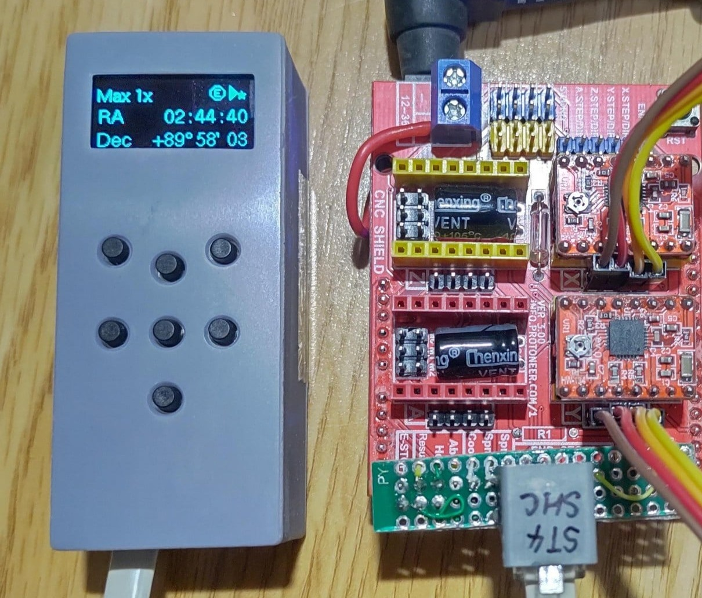

# OnStep-Miniature-Smart-Hand-Controller

## About
This is a much smaller design of the [Smart Hand Controller](https://onstep.groups.io/g/main/wiki/7152) for [OnStep](https://onstep.groups.io/g/main)*1.
It is based on the [OnStep ESP32 Smart Hand Controller](https://baheyeldin.com/astronomy/onstep-esp32-smart-hand-controller-shc.html) circuit.

*1: OnStep is an open source GoTo motor drive for telescope mounts

## Parts List

* [DOIT ESP32 DEVKIT V1](https://www.amazon.com/s?k=DOIT+ESP32+DEVKIT+V1)
  * Note: Unlike the original ESP32 SHC, this design uses the DOIT ESP32 DEVKIT V1 with 30 pins.
* PCB ( refer to kicad directory )
* [0.96" SSD1306 OLED Module](https://www.amazon.com/s?k=0.96+ssd1306+oled)
* Modular Jack 6P6C x 2
* 7 Resistor Network (2K ohm)
* 4 Resistor Network (2K ohm)
* 2.54mm Header Pins 15pin F x 2, 4pin M, 2pin M 
* Case ( refer [miniSHCcase.stl](miniSHCcase.stl)

## License
This is licensed under the [TAPR Open Hardware License](https://tapr.org/the-tapr-open-hardware-license/), one of the well-known open-source hardware licenses.
